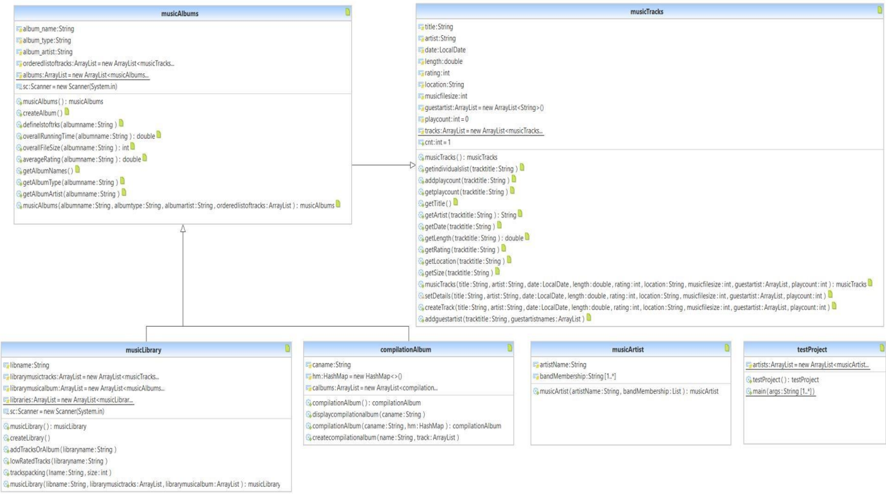

# Music_Library
The Music Library project is the depiction of an application that stores information about music tracks with multiple functions.

# Music Library Project

## Introduction
The **Music Library** project is a Java-based application that manages information about music tracks, artists, albums, and libraries. It incorporates several core concepts of **object-oriented programming** (OOP) such as classes, objects, inheritance, exception handling, and collections. The project demonstrates how to build robust, scalable applications using these principles along with file I/O operations, sorting, and searching algorithms.

## Features
- Store and manage music tracks, albums, and libraries.
- Add guest artists to tracks and track play counts.
- Create and manage albums, including ordering tracks by title.
- Calculate overall running time, file size, and average rating of albums.
- Support for both file-based and terminal-based user inputs.
- Support for backing up music tracks using disk packing algorithms.

## Technologies Used
- **Language**: Java
- **IDE**: Eclipse
- **Java Development Kit**: JDK
- **Java Runtime Environment**: JRE

## UML Diagram
  

## How to Run the Project
### Step-by-Step Instructions
1. **Open the Project in Eclipse IDE**:  
   - Go to `File` -> `Open Projects from File System` -> Click on `Directory` -> Select the project folder -> Click `Finish`.
  
2. **Classes**:  
   The project consists of six main classes:
   - `musicArtist`
   - `musicTracks`
   - `musicAlbums`
   - `musicLibrary`
   - `compilationAlbum`
   - `testProject` (contains the main method)

3. **Running the Application**:  
   - Run the `testProject.java` file that contains the `main()` method.
   - The console will display initial data about tracks, albums, and libraries.
  
4. **Executing Operations**:
   - Choose an operation number (1-52) in the console.
   - Operations are divided into two parts:
     - **Cases 1-25**: File-based inputs, reading data directly from files.
     - **Cases 26-52**: Terminal-based inputs, where you enter data directly into the terminal.

5. **Operation Continuity**:  
   After executing an operation, the system will prompt if you'd like to continue. Enter `1` to execute more operations without restarting the program.

## Classes and Methods Overview

### 1. `musicArtist` Class
- **Description**: Manages artist information and band memberships.
- **Fields**:
  - `artistName`: Stores the name of the artist.
  - `bandMembership`: A list of bands the artist belongs to (or "Soloist").
- **Constructor**: Initializes the artist's name and band memberships.

### 2. `musicTracks` Class
- **Description**: Stores track details (title, artist, date, length, etc.).
- **Methods**:
  - `createTrack`: Creates a new track.
  - `addGuestArtist`: Adds guest artists to a track.
  - `getPlayCount`, `addPlayCount`: Manage and retrieve play counts.
  
### 3. `musicAlbums` Class
- **Description**: A collection of tracks stored in an album, ordered by title.
- **Methods**:
  - `createAlbum`: Creates a new album.
  - `overallRunningTime`: Calculates the total running time of an album.
  - `overallFileSize`: Returns the total file size of the album.
  
### 4. `musicLibrary` Class
- **Description**: Manages a collection of tracks and albums.
- **Methods**:
  - `createLibrary`: Creates a new music library.
  - `lowRatedTracks`: Displays the lowest-rated tracks.

### 5. `compilationAlbum` Class
- **Description**: Stores tracks along with their original album names using a `HashMap`.
- **Methods**:
  - `createCompilationAlbum`: Creates a compilation album from various tracks.

### 6. `testProject` Class
- **Description**: Contains the main method and tests all the methods from other classes.
- **Main Method**: Handles user interaction, operation selection, and method invocation.

## Disk Packing Algorithm
The project includes an implementation of the **best-fit bin packing algorithm** to back up tracks to the minimum number of disks based on their file size. This algorithm efficiently manages disk space while minimizing the number of disks required.

## References
- [Java Lambda Expressions with Collections](https://www.geeksforgeeks.org/java-lambda-expression-with-collections/)
- [Bin Packing Problem](https://www.geeksforgeeks.org/bin-packing-problem-minimize-number-of-used-bins/)

